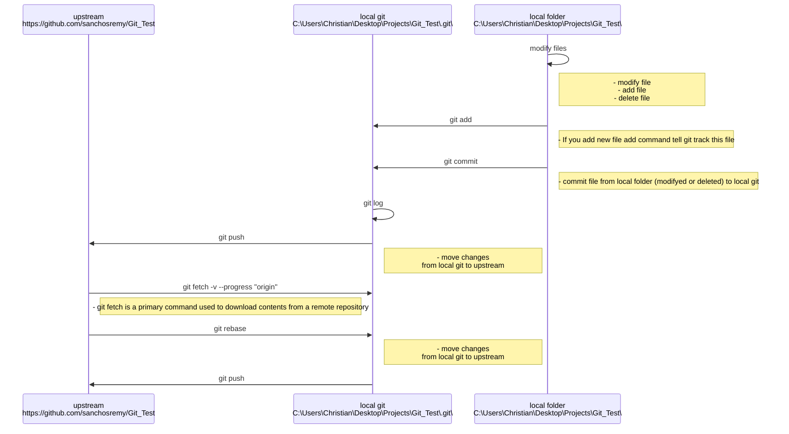

# Git Hub workflow

<!-- mdformat-toc start --slug=github --maxlevel=6 --minlevel=1 -->

- [Git Hub workflow](#git-hub-workflow)
  - [GitHub sequence diagram](#github-sequence-diagram)

<!-- mdformat-toc end -->

## GitHub sequence diagram

